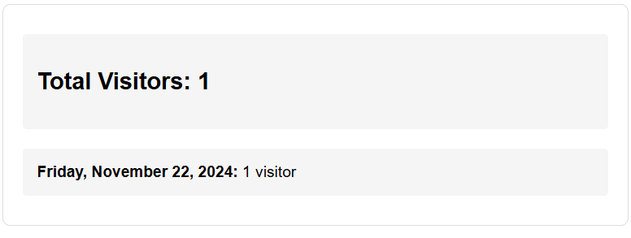

# Wadie Coder Landing Page

A modern, responsive landing page showcasing Wadie's professional services and upcoming portfolio platform.

## screenshot_ui

## Features

- Responsive design that works on all devices
- Modern UI with smooth transitions and hover effects
- Clean typography and engaging visuals
- 3D-styled profile section with auto-animation
- Services showcase with social media integration
- Medium blog integration
- Announcement section for upcoming portfolio platform
- Text typing animation effects
- Mobile-friendly navigation

## Quick Start Guide for Freelancers

1. Clone this repository
2. Customize the following:
   - Replace `/assets/profile.png` with your own profile picture
   - Update social media links in `index.html`:
     - Medium blog URL
     - Instagram URL
     - GitHub URL
     - WhatsApp community link
   - Modify the hero text and description
   - Update services descriptions
   - Change the color scheme in `styles.css` if desired (current primary: #25A1FF)

## Technologies Used

- HTML5
- CSS3 (with modern features like Flexbox and Grid)
- JavaScript (for interactivity and animations)
- Google Fonts
- Typed.js for text animations

## Color Scheme

- Primary Blue: #25A1FF
- Black: #000000
- White: #FFFFFF
- Complementary colors derived from the primary blue

## Setup

1. Clone the repository
2. Replace the profile picture in the assets folder
3. Update all social media links
4. Open `index.html` in a modern web browser

## Mobile Responsiveness

The landing page is fully responsive with a persistent navigation menu on all devices.

## Visitor Tracking System

This project includes a built-in visitor tracking system that allows you to monitor site traffic without requiring a backend server.

## Screenshot_ui

### Features

- Real-time visitor counting
- Daily visitor statistics
- Detailed visitor information tracking including:
  - IP address
  - Browser details
  - Language preferences
  - Screen resolution
  - Time zone
  - Referrer information
  - Visit timestamp
  - Repeat visitor detection

### How to Use

1. Access the tracking page through `visitor_tracker.html`
2. The page will display:
   - Total visitor count
   - Daily breakdown of visitors
   - Automatic download of `visitor_data.json` containing detailed visitor information

### Data Storage

- Visitor data is stored locally using localStorage
- A JSON file (`visitor_data.json`) is automatically downloaded with each new visit
- No backend server required - all data can be collected manually from the JSON files

### Privacy Note

This tracker collects basic visitor information for analytics purposes. Consider adding a privacy notice to your site if you implement this tracking system.
